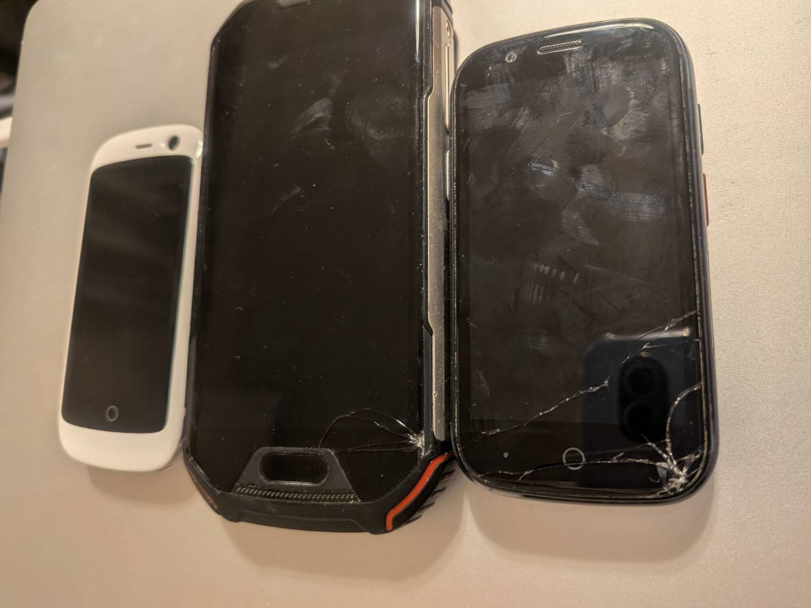

## また画面が割れた

私がスマホを（いや家電製品全般に言えるが）、買い替えるトリガーは基本的には故障だ。スマホの場合は画面割れが十中八九だ。

修理を行ったことも一度だけあるが、基本保険にも何も入っていないので、修理代と新規購入代はそこまで変わらない。なので新しく買う。

最初は丁寧に扱うけど、１週間もすると雑になって、よく落としたりして割ってしまう。

今回もふとジョギング中に不意に盛大にコイントス(スマホトス=スマホ落とす)をし、裏面が出た。

拾って表面を見るとき、瞬間的には合格発表より緊張する。

またやってしまった。

## 最高のスマホ、それはUnihertz。Unihertzとの出会い。

数年前のある日、前々職の会社のサークルで野外イベントに参加しているとき、あるサークルの仲間が待ち時間に何やら手元で何かしている様子だった。

その人はガタイがよく長身。よく見ると手元はスマホだった。スマホがスッポリと手の中に収まっていた。最初、その人がでかいから錯視でスマホがちっちゃいのかと0.05秒疑ったが、いやそれにしても明らかに小さい。

「なんですかそれ」

それが私とのUnihertzとの出会いである。

仲間が使っていたのは、中国のUnihertz社が販売していた「Jelly Pro」という世界最小のスマホだった。

[Jelly Pro](https://www.unihertz.com/ja-jp/products/jelly-pro?srsltid=AfmBOop-jB66Ymh6yqh3V3Seb7yXpSNCKYmmIcIxKS9LCCSFnzyMTMpk)

なんか妙に惹かれて、即日Amazonでポチった。翌日届いた。

めちゃくちゃ小さいが、よくよく調べるとAndroidでできることはほぼ全てできる。LINEもできるし、写真も撮れる。YOUTUBEも見れる。たいていのゲームもできる。
つまり小さい画面で機能はなんら問題はない。

操作中の効果音や充電音も可愛らしい感じ。

片手に収まるので、実は慣れればすごく使いやすい。

バッテリーの持ちが非常に悪いことがいちばんのデメリットだが、基本家と会社の往復しかしない私にとって、
家出る前に満充電にして、片道1時間30分の通勤で、会社着く頃には30%になっているけど会社でまた充電すれば無問題。通勤中のスマホいじいじタイムになんら影響はなかった。

Jelly Proをメイン端末にしていた。1年程利用していたが、ディズニーランドのトイレ出口付近で盛大にトスをして割った。

あまりに気に入っていたので、同じものの色違い（黒->白）を再度ポチってまた数年？使った気がする。

いつしか、サイズそのものよりもUnihertzというメーカーのファンになっていた。クラウドファンディングで支援し、Unihertzの「Atom L」を手に入れた。

[Atom L](https://www.unihertz.com/ja-jp/products/atom-l?srsltid=AfmBOop5euRS8DcZRSCnoNKXffnkoBVyb3VAKb48Fs082ia8C10fGCJi)

これは小さい端末ではないがこれもまた他のスマホとはちょっと違うもので、とにかくタフでゴツい見た目。人と違うスマホを持っているのが謎にちょっと誇らしかった。「なにそれ！」と人から突っ込まれると嬉しかった。

これも自転車で信号待ちしている時に、ナビのため自転車のカゴに置いておいたものが滑り落ちてかごから落下し割った。

側面裏面は頑丈な作りのようだったが、画面は脆弱なようで、割ってしまった。

次は Unihertzの「Jelly Star」

[Jelly Star](https://www.unihertz.com/ja-jp/products/jelly-star?srsltid=AfmBOoqTqCNEor1yBbO3dQJustt_DwbvD9wjVg3ny-j9i0BqnPwZMgnX)

Jelly Proの後継機にあたるもので小型スマホ。バッテリーの持ちもJelly Proの約2倍 2000 mAh,全体的にスペックアップして、多少大きくはなったが、まだ人目を引くほどには小さい。

これはかなりお気に入りだった。いつも肌身離さず持ち歩いていて、体の一部だった。

しかしこれも先週ジョギング中に落としてしまって、画面を割ってしまった。

さて、次のを探すか

## Unihertzとの別れ。アイデンティティの喪失

Unihertz、大抵問題なかったが、たまに困るシーンがあった。
* 画面が小さくて、バーコードやQRコード小さく表示されてしまうため、こちらが画面を提示して相手が読み取るタイプのシーン（コード決済時など）でたまに反応しないことがあった。
* Felicaが搭載されていないため、モバイルSuicaを入れることができない。物理的なカードを持っていて、通勤中はそれを利用していた。
* 決済も基本的には現金 or クレジットカード(物理)。スマホで決済できるとそれは便利そうだったが、諦めていた部分があった
* カメラの画質が一般のハイエンドスマホと比較して非常に悪い。情報として残す目的でカメラを利用すうのはいいが、思い出を残す目的ではほぼほぼ良いものではなかった。

これらのデメリットを上回るほど、愛着が湧いてはいたが、今回離れることにした。

最近色々と時間がなく、効率化したい場面が多くある。AIをもっと活用した生活が送りたいし、スマホで色々と情報活用・効率化をしたいと考えていた。それを満たすためには、やはり、現状の小型スマホだとちょっと限界があるところがある。なので、一旦離れてみることにした。Unihertzの大型端末もありだったが、やっぱりUnihertzは小型に惹かれたのであって、大型端末に買い替えるくらいだったら、知名度・人気があるものの方が、メリットが多い。

利用者が多いスマホは、それほどユーザの評価に晒される・フィードバックが多く得られるため、改善を図りやすく、基本的にはよりよい作りになっているという仮説がある。

なので利用者が多いものから選ぶことにした。

iPhoneはなんかプライドが許さなかった。

元々2009年ごろ、iPhone3Gが私のスマホデビューであった。その後iPhone4sを使ったりと、iPhoneを食わず嫌いしているわけではないが、
個人的な感覚としてiPhoneはなぜか嫌だと感じる。

iPhoneというよりもMac製品がなんか近寄りがたい感じがした(これは正確な理由はわからない、生理的なもの)ので、選択肢からは除外した（PCはMacを使っているけどね）

となると、Google Pixelが良さそうだった。しかし今スマホって高いのね。Unihertz製品はどれも5万円未満で買えていたけど、iPhoneやGoogleのハイエンドスマホともなると平気で10万円を超えてくる..

---

Unihertzとお別れして、アイデンティティが一つ喪失した。
他に何もアイデンティティがない私。
唯一変なスマホを使っているというところにアイデンティティを見出していた。今回それを手放すことになったけど、一旦アイデンティティを減らしていくというのは今の私にとって必要なことなのではないかと感じている。

日々の生活を効率化して楽したいという現状の私においては、周りのやり方に合わせる。それ即ちベストプラクティスに則るのが一番だ。多くの人が採用している方法は、力学的に最もエネルギーが少なく効率的なものに違いないと考えている。

一旦周りに身を任せ。他の人と他の人と同じ方法をとって、自分の身の回りのエネルギーを最小化しつつ、心身ともに健康になりたい。健康を維持したい。

## Unihertzの仲間たちを紹介

最初にディズニーで落としたやつは見つからなかったが（おそらく画面バキバキになったので捨てた？）過去3台はあったので、

全て工場出荷状態に戻した。

左から Jelly Pro, AtomL, Jelly Star

みんなありがとう！