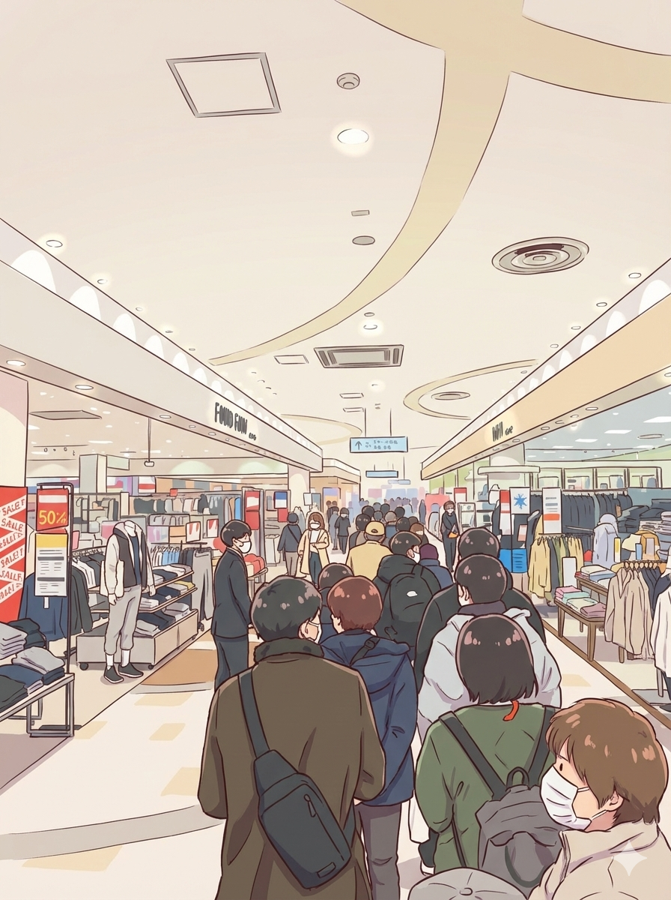

## ゆきいいいい

明日2/8は待ちに待ったさいたまマラソン。2019, 2024, 2025に続き今回4度目のさいたまマラソン。

厳密には、2019まではさいたま国際マラソンという名で、主に、エリート選手の選考会が主目的だった。

しかし2024年以降はさいたまマラソンという名前にちょっとだけ変わって目的も市民ランナーのためのものに変わった。

しかしコースはほぼ同じ。起伏が激しく割と難易度の高いマラソン大会らしい。

2019では、自己ベストを叩き出し、サブスリーまでもう一歩ということろまできて、思い入れのある大会だ。

今回も割と気合を入れていて、自己ベスト更新とまでいかないものの、セカンドあるいはサードベストを狙えるくらい練習を積んできた。

しかし、しかし、、、

雪予報。。それまで数週間雨・雪はは全く降らず、週末木金も暖かかったのに、ピンポイントに狙ったかのように雪予報。
土曜日の夕方から降り始め、日曜日の午前中雪が降るとのこと。日曜日の9時スタートなので、誰かの意思が働いているのではないかと
思わせるほどピンポイント。

午後からは晴れるらしいが、午後に晴れても意味がない。午前中スタートから完走までのコンディションは現状の予報だと最悪中の最悪。
中止なのではという噂も囁かれている。まだ公式からは告知されていないが。。

去年2025も過酷だった。

3月の開催だったが、大会前日以前と翌日以降までは晴れてすごいいい天気だった。しかし、当日だけ季節外れの極寒の雨。暴風雨。
寒くて寒くて、冷たくて冷たくて本当に辛かった。

開催されたからまだマシだったけど、今回は中止になる可能性がある。もしそうなったら最悪。。

参加料の返金もないだろうな。。なんでこうなるかな。

ところで、明日2/8といえば衆議院議員選挙でもある。これも急遽決まったものだ。
明日はもちろん投票に行けないので、本日近くのショッピングモールに期日前投票に行ってきた。
向かう途中いつもより車の交通量が多かった。非常に多かった。
ショッピングモールも人がたくさんいて、おそらく、明日雪予報のため、前日に食料品を買い込もうという人や、
やはり私と同じように期日前投票に行こうという人が大勢いたのだろう。

期日前投票の行列にびっくりした。

しかし紙に書いて箱に入れるだけというシンプルな作業なので思ったよりも流れるのが早く、あっという間に順番は回ってきた。
投票し終えて、明日カーボロードのための食料品を買い込む。先週届いた新スマホで初めてドキドキ決済。

貼るカイロと、100均で使い捨て用レインコートも仕入れて帰宅の途中、

量の多い車を眺めてふと思った。

明日天気予報外れないかな？ワンチャンあるかも？
こんなに車多いもん。

基本天気予報って統計的なものから導き出しているよな。
今回の交通量の多さは、統計的には外れ値。選挙も急に決まったし。

こんなにブンブン車走ってれば、地面との摩擦熱や気流の乱れで何かしらのエネルギーの変化で気候変動起きないかな。

バタフライエフェクトってあるじゃん。ブラジルで蝶が羽ばたけばニューヨークで竜巻が起こるみたいな。

微細な気圧変化でもそれが別の箇所に徐々に伝播して、大きな変化を生み出す。
例えるならこんな感じ。

<iframe width="560" height="315" src="https://www.youtube.com/embed/SdxUbuVPKh8?si=VNoJHYjNI5h35s6R" title="YouTube video player" frameborder="0" allow="accelerometer; autoplay; clipboard-write; encrypted-media; gyroscope; picture-in-picture; web-share" referrerpolicy="strict-origin-when-cross-origin" allowfullscreen></iframe>

車よ、もっと走れもっと走れと心の中で呟きながら家に着く。

まだ諦めてはいないぞ。今日は予定通り炭水化物たくさん摂取して明日に備える。しっかり足を休めて明日の準備をする